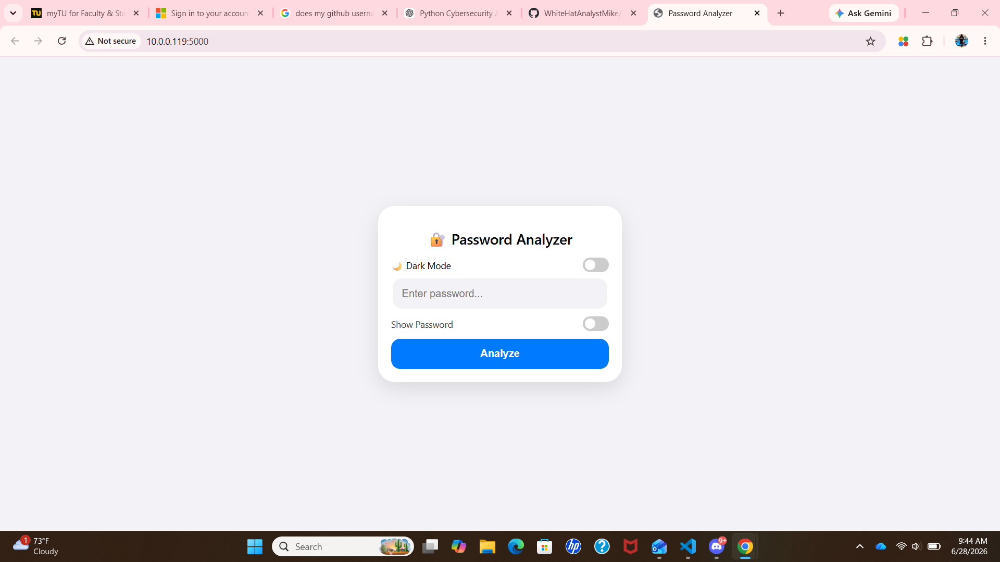
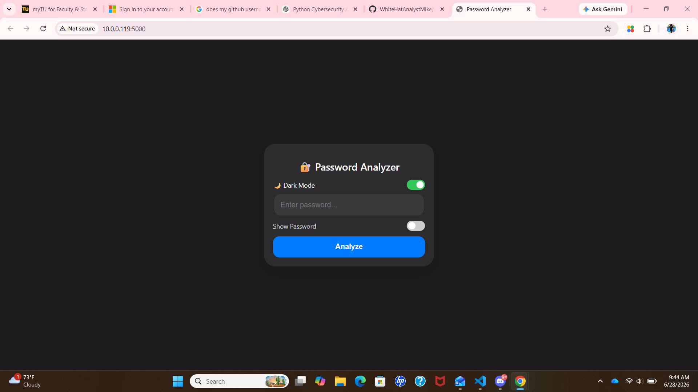
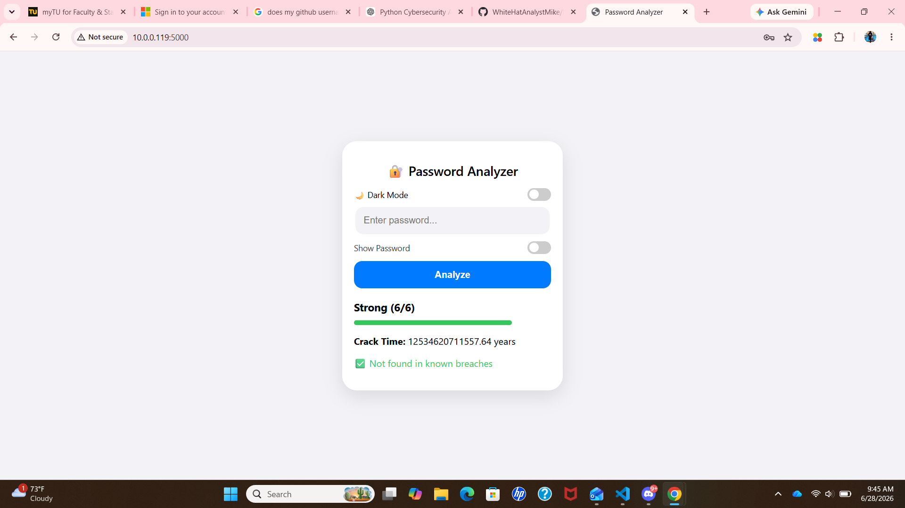
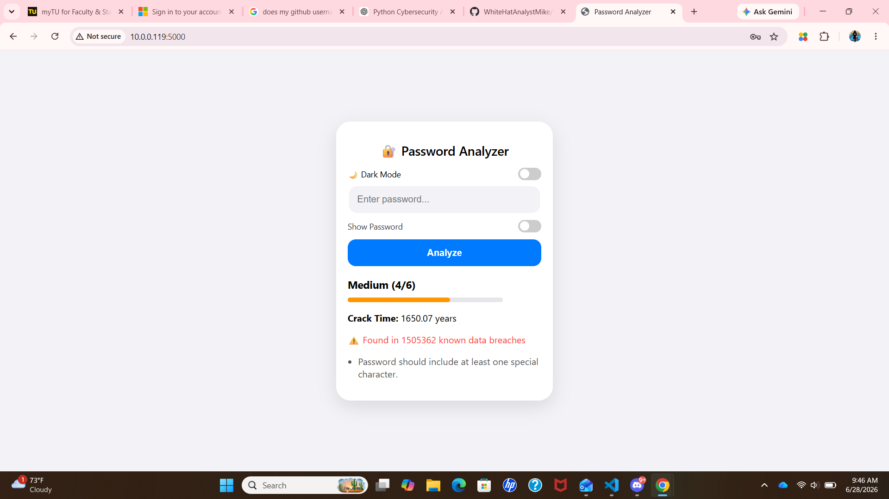

# 🔐 Password Security Analyzer

A Flask-based cybersecurity web application that analyzes password strength, estimates password crack time, and checks whether a password has appeared in known data breaches using the **Have I Been Pwned (HIBP) API**.

I built this project to strengthen my Python, Flask, and cybersecurity skills while gaining experience designing, developing, and deploying a full-stack web application.

🌐 **Live Demo:** https://password-analyzer-yoap.onrender.com/

📦 **GitHub Repository:** https://github.com/WhiteHatAnalystMike/Password-Security-Analyzer

---

# Overview

Weak passwords continue to be one of the most common causes of compromised accounts. The goal of this project is to help users better understand the security of their passwords by providing real-time analysis, estimating how long a password would take to crack, and checking whether it has appeared in publicly known data breaches.

While building this application, I focused on writing clean, organized code, integrating external APIs, and creating an interface that is both responsive and easy to use.

---

# 📸 Application Preview

## Home Screen (Light Mode)

The application opens with a clean, mobile-friendly interface where users can enter a password, switch between light and dark mode, and begin an analysis.



---

## Home Screen (Dark Mode)

The application also supports a persistent dark mode, allowing users to switch themes while maintaining the same responsive experience.



---

## Strong Password Analysis

A strong password receives the highest security score, an estimated crack time, and confirmation that it has not appeared in known public data breaches.



---

## Breached Password Detection

If a password has appeared in previous data breaches, the application alerts the user, displays the number of known breaches, and provides recommendations to improve password security.



---

# Features

* Password strength analysis
* Password crack-time estimation
* Have I Been Pwned (HIBP) breach detection
* Personalized security recommendations
* Responsive design for desktop and mobile devices
* Dark mode with saved user preferences
* Fast Flask backend with dynamic page updates

---

# Technologies Used

| Category        | Technology            |
| --------------- | --------------------- |
| Language        | Python                |
| Framework       | Flask                 |
| Frontend        | HTML, CSS, JavaScript |
| API             | Have I Been Pwned API |
| Deployment      | Render                |
| Version Control | Git & GitHub          |

---

# Project Structure

```text
Password-Security-Analyzer/
│
├── assets/
│   └── screenshots/
│       ├── home-light.png
│       ├── home-dark.png
│       ├── strong-password-light.png
│       ├── strong-password-dark.png
│       ├── breached-password-light.png
│       └── breached-password-dark.png
│
├── static/
│   └── style.css
│
├── templates/
│   └── index.html
│
├── analyzer.py           # Password strength analysis
├── breach_checker.py     # HIBP API integration
├── main.py               # Flask application
├── requirements.txt      # Python dependencies
├── .gitignore
└── README.md
```

---

# Running the Project

Clone the repository:

```bash
git clone https://github.com/WhiteHatAnalystMike/Password-Security-Analyzer.git
```

Move into the project directory:

```bash
cd Password-Security-Analyzer
```

Create a virtual environment:

```bash
python -m venv .venv
```

Activate the virtual environment.

**Windows**

```bash
.venv\Scripts\activate
```

Install dependencies:

```bash
pip install -r requirements.txt
```

Run the application:

```bash
python main.py
```

Open your browser and navigate to:

```text
http://127.0.0.1:5000
```

---

# Security Concepts Demonstrated

This project demonstrates several cybersecurity concepts, including:

* Password strength evaluation
* Password complexity analysis
* Crack-time estimation
* Secure handling of user input
* Password breach detection using the Have I Been Pwned API
* The HIBP k-Anonymity model, which allows passwords to be checked without transmitting the complete password

---

# What I Learned

Building this project gave me hands-on experience with:

* Developing a full-stack web application using Flask
* Organizing Python code into reusable modules
* Integrating a third-party REST API (Have I Been Pwned)
* Deploying a Python application with Render
* Using Git and GitHub for version control and collaboration
* Applying cybersecurity concepts to a real-world application
* Designing a responsive user interface with HTML, CSS, and JavaScript
* Debugging and solving real-world development challenges


---

# Future Improvements

Some features I plan to add include:

* Secure password generator
* Password entropy calculations
* Password history comparison
* Exportable security reports
* Additional cybersecurity tools and utilities

---

# Deployment

The application is deployed on Render and is publicly accessible through the live demo link above. Deployment includes:

- Flask production configuration
- Dependency management with `requirements.txt`
- Environment-based configuration
- Continuous version control with Git and GitHub

---

# About Me

**Michael Koranteng**

Computer Science student at Towson University with an interest in cybersecurity, software engineering, and secure application development.

GitHub: https://github.com/WhiteHatAnalystMike

---

# Why I Built This Project

I built this application to improve my software development skills while learning more about password security and API integration. My goal was to create a practical cybersecurity tool that combines secure programming practices with a clean and user-friendly interface.

If you have any suggestions or feedback, feel free to open an issue or reach out.

